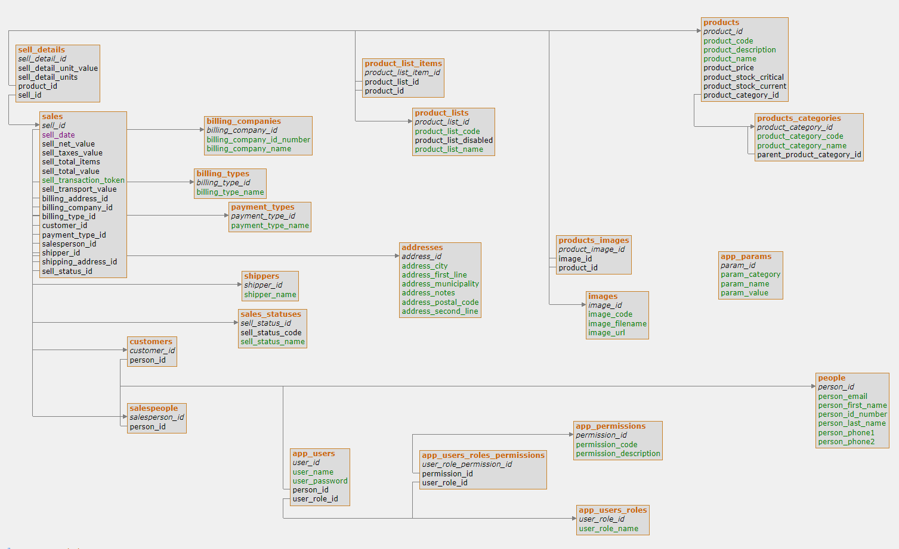

# Trébol Backend
<!-- ALL-CONTRIBUTORS-BADGE:START - Do not remove or modify this section -->

<!-- ALL-CONTRIBUTORS-BADGE:END -->

This application is a complete, monolithic, Spring Boot-based backend for the eCommerce project Trébol.

## Features:

* Exposes a [RESTful API](https://github.com/trebol-ecommerce/trebol-api)
  * Supports all operations as described by the document
  * Filtering, sorting and pagination of data are implemented through query params
  * Login, registration and guest accounts
  * Checking out with user or guest accounts
* Uses Spring Data JPA
  * Annotated entity classes; including constraints and indexes where they are most needed at scale
    * Bundles drivers for H2 and MariaDB, but can virtually connect to any JDBC-compatible database with the correct driver
* Uses Spring Security
  * Stateless session authentication/autorization with JWT
    * Paired with `users`, `roles`, and `permissions` database tables (see `/src/main/resources/data.sql` for an example setup with 4 roles and users)
    * Do note that Authorities required in some controllers are hard-coded. These must match entries in the `permissions` table
  * Passwords are encoded using BCrypt
* Integrates payments with [Webpay Plus](https://transbankdevelopers.cl/producto/webpay) by Transbank ([Java SDK repo](https://github.com/TransbankDevelopers/transbank-sdk-java))
  * On due time, it may be possible to integrate more popular payment services such as Paypal and Stripe
* Integrates mail notifications with [Mailgun](https://mailgun.com) (an account is required)
* Human-friendly sample properties files for configuring mission-critical parameters such as:
  * CORS mappings
  * JWT secret key and duration
  * BCrypt algorithm strength
  * Webpay integration endpoints
  * Mailgun & general mail properties
* And all other Spring Boot goodness!

### Data model diagram

This schema was designed in a couple minutes using [Azimutt](https://github.com/azimuttapp/azimutt), a MIT-licensed, handy navigation and diagram visualization tool for Entity-Relationship models.

## Status

Supporting [API v1.5.0](https://github.com/trebol-ecommerce/api/blob/bglamadrid/main/trebol-api.json).
Recently the underlying data model has suffered a few changes, please view the `CHANGELOG.md` file for details.

## Requirements

* JDK 11+
* Apache Maven 3.6.0

## Getting started

After cloning the repository, I recommend to run `mvn verify`, grab a drink and wait a little. That command will download/install dependencies, compile the project, generate the WAR package file, install it to your local maven repo, run unit tests and check code coverage.

__The important step here is to compile the project first__, because some classes are not versioned and instead must be generated through a Maven plugin that is provided in the project dependencies.

If for any reason you fail to compile, please run `mvn generate-sources` and try it again.

Once you're done with the above, you can quickly run the application with `mvn spring-boot:run`

Mailgun integration will only be available if the `mailgun` profile is active. Please read the `application-mailgun.empty.properties` file and [this bit of the Spring Boot documentation](https://docs.spring.io/spring-boot/docs/current/reference/html/features.html#features.profiles) to know how to proceed with that.

### Configuration

The default configuration profile, which is located at `/src/main/resources/application.properties` contains sane default settings.
You "can" run the application out-of-the-box with these, though you'll need to change several options if you're to install it on production.

## Contributing to this repository

Please review the [contributing guidelines](https://github.com/trebol-ecommerce/spring-boot-backend/blob/main/CONTRIBUTING.md) before proceeding.

## Contributors ✨

Thanks goes to these wonderful people ([emoji key](https://allcontributors.org/docs/en/emoji-key)):

<!-- ALL-CONTRIBUTORS-LIST:START - Do not remove or modify this section -->
<!-- prettier-ignore-start -->
<!-- markdownlint-disable -->
<table>
  <tbody>
    <tr>
      <td align="center"><a href="http://amigoscode.com"> <b>Amigoscode</b></a> <a href="#ideas-amigoscode" title="Ideas, Planning, & Feedback">🤔</a></td>
      <td align="center"><a href="http://benjaminlamadrid.cl"> <b>bglamadrid</b></a> <a href="https://github.com/trebol-ecommerce/spring-boot-backend/commits?author=bglamadrid" title="Code">💻</a> <a href="#design-bglamadrid" title="Design">🎨</a></td>
      <td align="center"><a href="https://github.com/trangntt-016"> <b>Trang Nguyen</b></a> <a href="https://github.com/trebol-ecommerce/spring-boot-backend/commits?author=trangntt-016" title="Code">💻</a></td>
      <td align="center"><a href="https://github.com/ParundeepSingh"> <b>Parundeep Singh</b></a> <a href="https://github.com/trebol-ecommerce/spring-boot-backend/commits?author=ParundeepSingh" title="Code">💻</a></td>
      <td align="center"><a href="https://markus.mutas.dev"> <b>Markus Mutas</b></a> <a href="https://github.com/trebol-ecommerce/spring-boot-backend/commits?author=mutasDev" title="Code">💻</a></td>
      <td align="center"><a href="https://github.com/vaishakhvh"> <b>vaishakhvh</b></a> <a href="https://github.com/trebol-ecommerce/spring-boot-backend/commits?author=vaishakhvh" title="Code">💻</a></td>
      <td align="center"><a href="https://github.com/NyorJa"> <b>Rod Fetalvero</b></a> <a href="https://github.com/trebol-ecommerce/spring-boot-backend/commits?author=NyorJa" title="Code">💻</a> <a href="https://github.com/trebol-ecommerce/spring-boot-backend/commits?author=NyorJa" title="Tests">⚠️</a></td>
    </tr>
    <tr>
      <td align="center"><a href="https://mepox.github.io/"> <b>mepox</b></a> <a href="https://github.com/trebol-ecommerce/spring-boot-backend/commits?author=mepox" title="Code">💻</a> <a href="#maintenance-mepox" title="Maintenance">🚧</a> <a href="#ideas-mepox" title="Ideas, Planning, & Feedback">🤔</a></td>
    </tr>
  </tbody>
</table>

<!-- markdownlint-restore -->
<!-- prettier-ignore-end -->

<!-- ALL-CONTRIBUTORS-LIST:END -->

This project follows the [all-contributors](https://github.com/all-contributors/all-contributors) specification. Contributions of any kind welcome!
